<!-- Header -->

  

  

  

  

*Bet on curiosity. Precise by choice. Different by design.*

*Haven't lost yet.*

## 

Here's what I've actually built and worked with:

- **SIEM:**
  

- **Monitoring & Detection:**
  
  
  

- **Systems:**
  
  
  

- **Virtualization:**
  
  

- **Networking:**
  
  
  

## 

- **Languages:**
  
  
  

- **Tools:**
  
  
  
  
  

## 

**esc —** self-hosted SOC environment on Apple Silicon. Full Wazuh stack, isolated network, live alert detection.
Deployed component-by-component. Documented completely — correct steps, real errors, working fixes. Nothing hidden.

## 

·  — Background's there, if you're curious.

·  — Work's all here. Take a look.

---
<i>"Anyway, that's it." — Iso</i>
